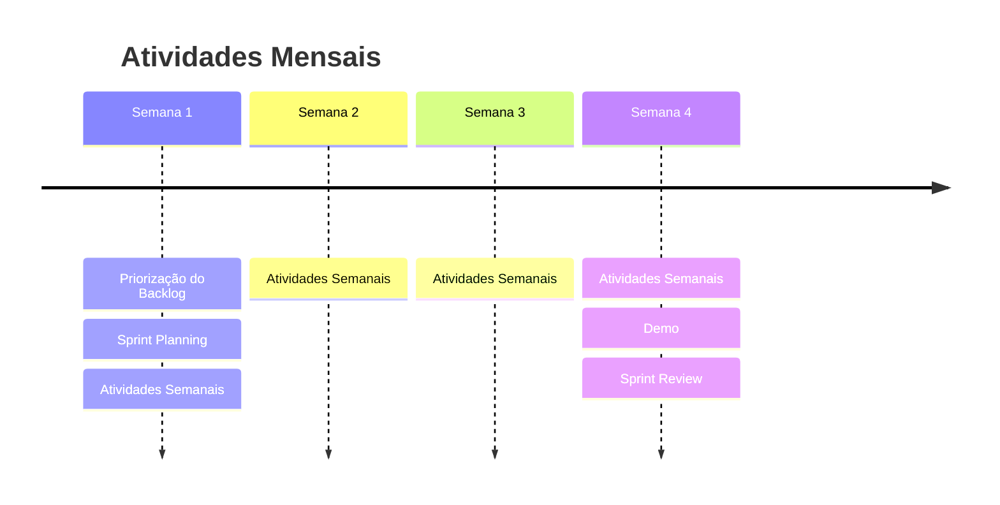
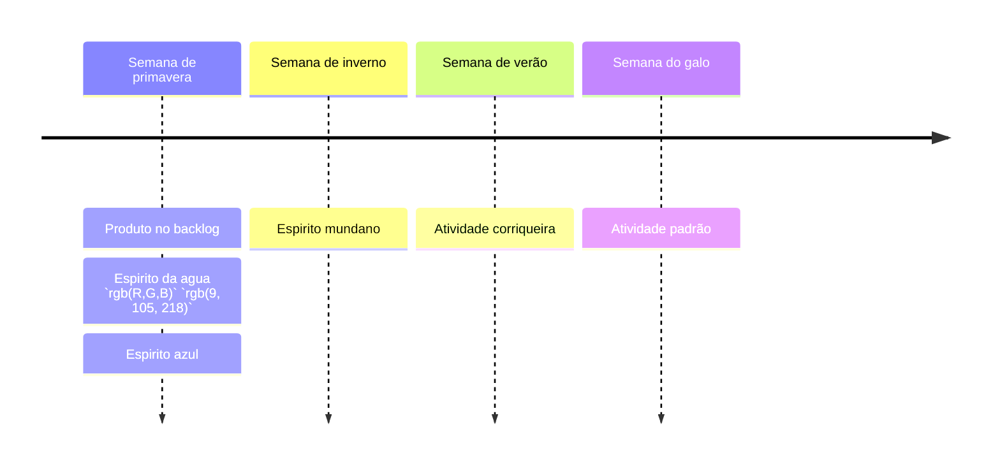

# repoposs
Repositório da disciplina de Introdução de Devops

estudo de plataforma

```mermaid
timeline
    title Atividades Mensais
    Semana 1 : Priorização do Backlog
             : Sprint Planning
             : Atividades Semanais
    Semana 2 : Atividades Semanais
    Semana 3 : Atividades Semanais
    Semana 4 : Atividades Semanais
             : Demo
             : Sprint Review
```

```mermaid
timeline
        Semana de primavera : Produto no backlog
                            : Espirito da agua `rgb(R,G,B)` `rgb(9, 105, 218)`
                            : Espirito azul
        Semana de inverno   : Espirito mundano
        Semana de verão     : Atividade corriqueira
        Semana do galo      : Atividade padrão
```
